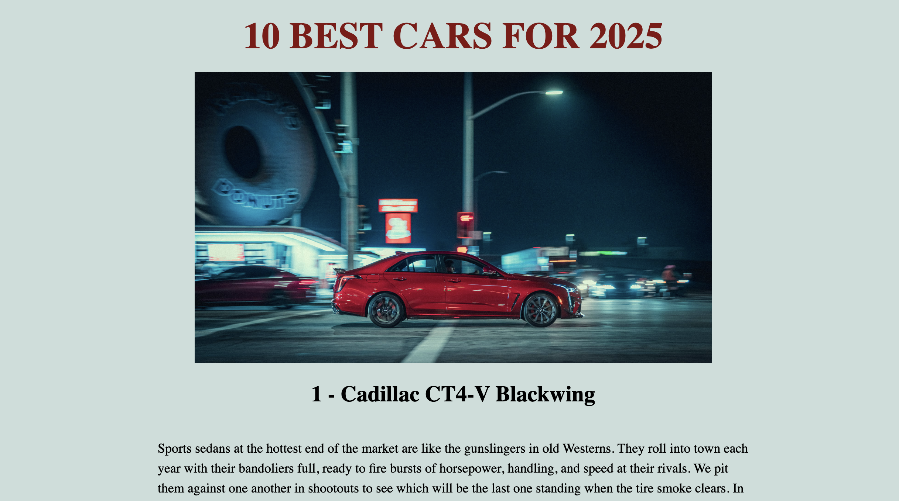

# 🚗 Best Cars 2025

A website showcasing the **Top 10 Best Cars of 2025**, featuring detailed descriptions of each model, key specifications, and reasons why they were selected.

## 🖼️ Screenshots



## 🔗 Live Demo

[https://best-cars2025.netlify.app/](https://best-cars2025.netlify.app/)

## 🖥️ Technologies Used

* React
* CSS Modules / Styled Components (if used)
* JSX
* Vite (if applicable)

## ✨ Features

* 🏆 Top 10 cars of 2025
* 📄 Detailed description for each model
* ⭐ Key reasons why each car made it into the ranking
* 📱 Fully responsive layout
* ⚡ Smooth and fast navigation

## 📁 Folder Structure

```
best-cars-2025/
  ├── public/
  ├── src/
  │   ├── components/
  │   ├── pages/
  │   ├── assets/
  │   └── App.jsx
  ├── package.json
  └── README.md
```

## ⚙️ Installation & Setup

```bash
git clone <your-repo-url>
cd best-cars-2025
npm install
npm run dev
```

## ♿ Accessibility & Responsiveness

* Mobile-first approach
* Clear visual hierarchy and contrast
* Easy-to-use interactive buttons
* Works across all modern browsers

## 🚧 Future Improvements

* 🔍 Add car filtering options
* 🚘 Create a comparison page for models
* 🌙 Add dark mode
* 🌍 Add multi-language support

## 👩‍💻 Author

### © 2025 Nataliia Litskevych

If you'd like to connect or collaborate — feel free to reach out!

